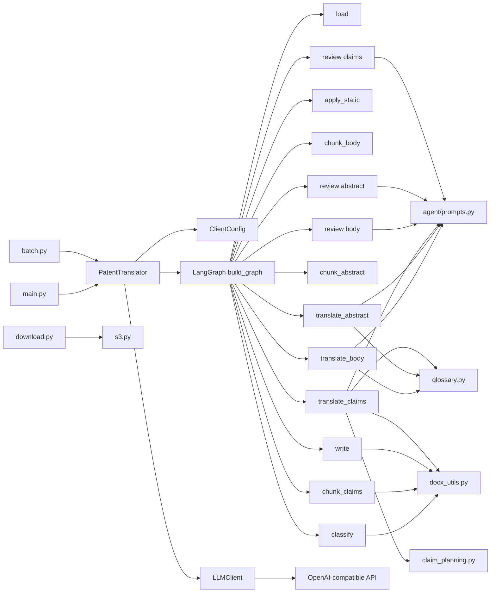
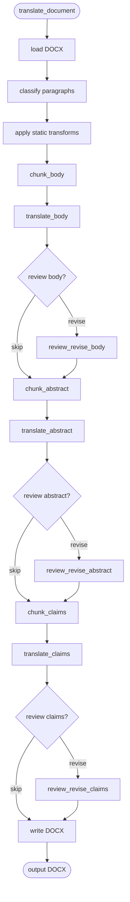
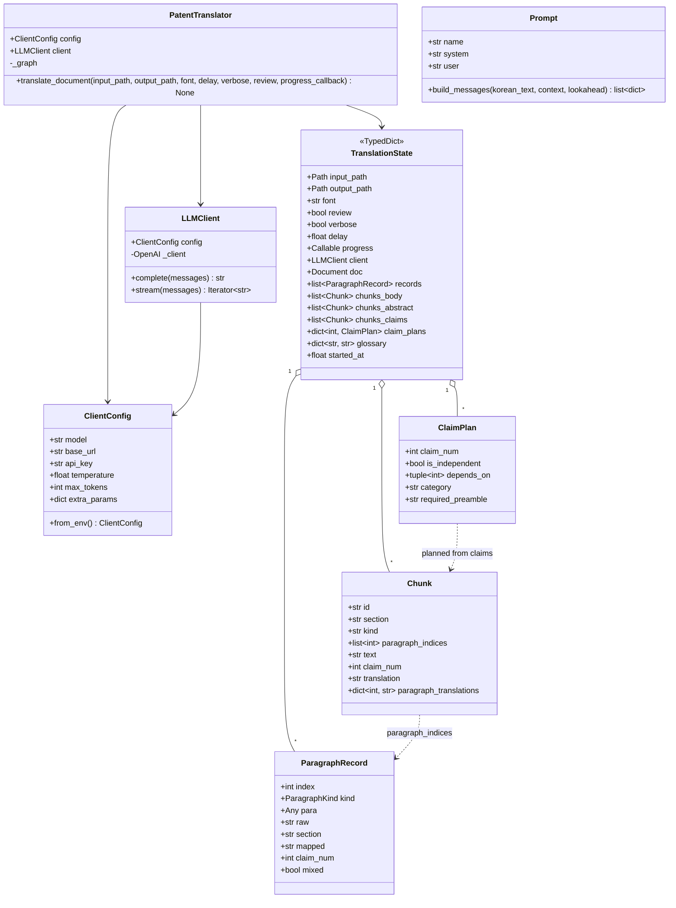
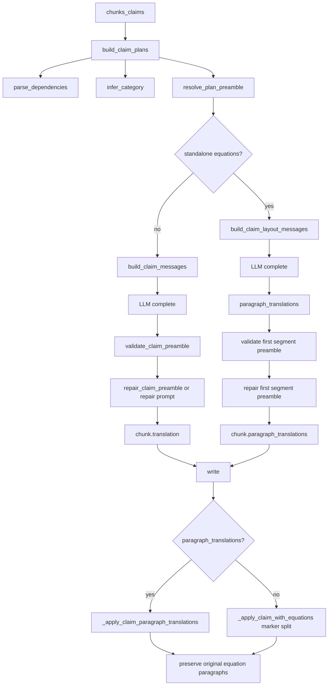
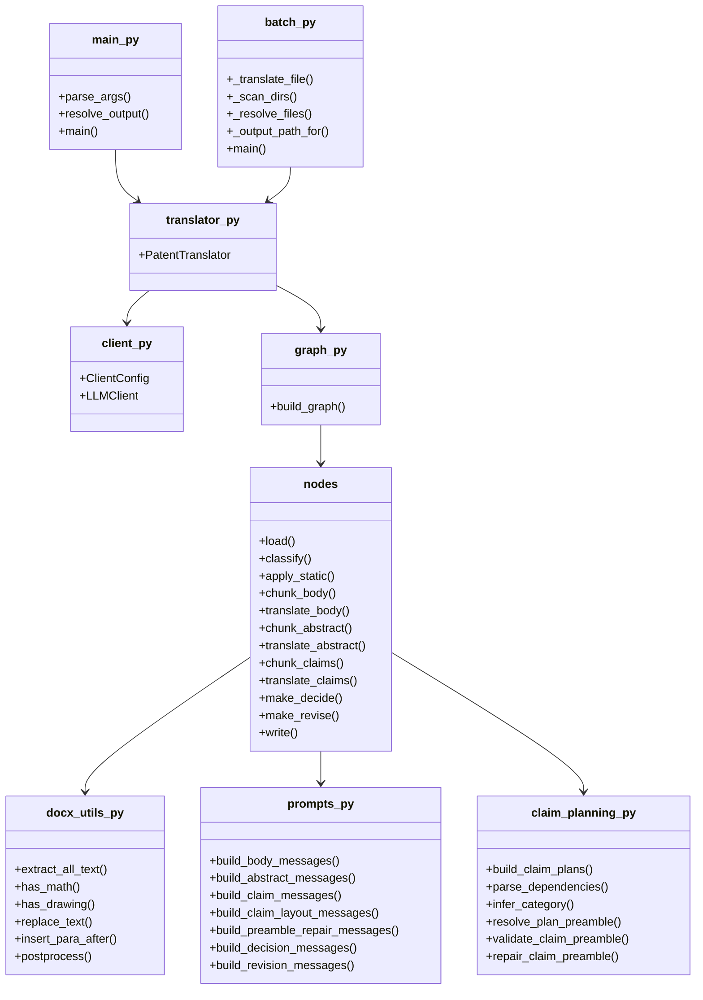
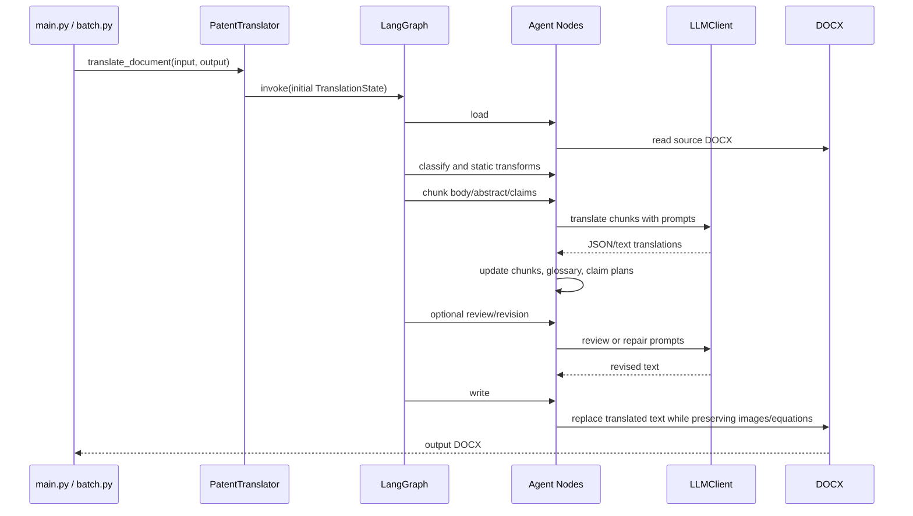

# Codebase UML

This document summarizes the current patent translation codebase using Mermaid
UML-style diagrams.

## High-Level Component Diagram

## Translation Pipeline

## Core Class Diagram

## Claim Translation Detail

## Module Responsibilities

## Data Flow Summary

