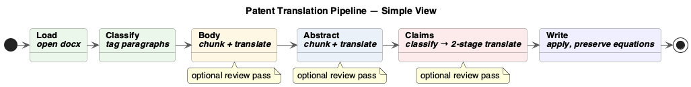
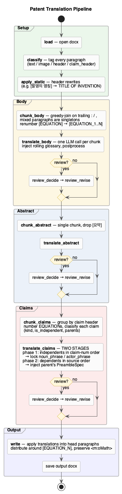
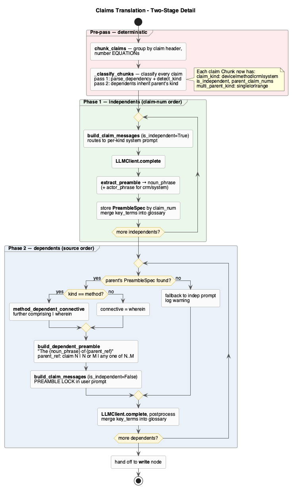
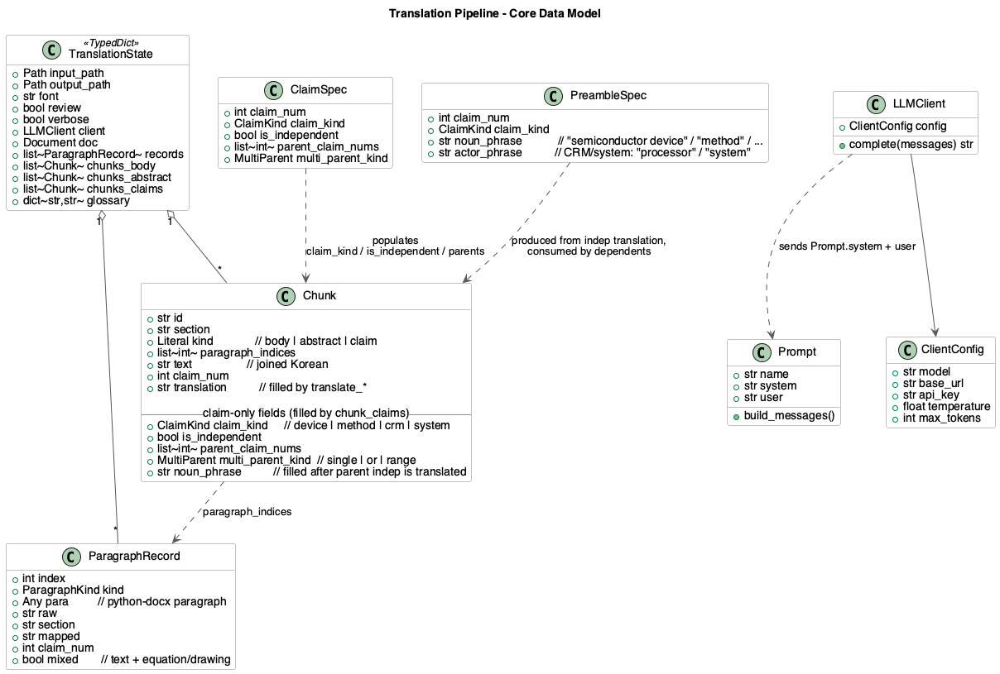

# Patent Translation Pipeline

This document explains the end-to-end flow of `PatentTranslator.translate_document`.
Diagrams are PlantUML; sources live next to the rendered PNGs in this folder.

To re-render after edits:

```bash
plantuml -tpng docs/*.puml
```

---

## At a glance



*Source: [`pipeline_simple.puml`](pipeline_simple.puml)*

Six stages, left to right. Body / Abstract / Claims each have an optional
review-and-revise pass. **Claims** is the most involved — see §2 below.

---

## TL;DR

**Entry** — `main.py` / `batch.py` builds a `ClientConfig`, instantiates `PatentTranslator`, and invokes a linear LangGraph compiled by `build_graph`. Linear-by-design so the rolling glossary stays coherent.

**Setup**
- `load` — copy input docx → output path, open with python-docx.
- `classify` — walk every paragraph, tag as `text` / `image` / `claim_header` / `section_header` / `blank`, detect math/drawing.
- `apply_static` — deterministic 1-to-1 header rewrites (e.g. `[발명의 명칭]` → `TITLE OF INVENTION`).

**Body**
- `chunk_body` — greedy-join paragraphs (continue if the previous ends `:` or `,`); mixed text+equation paragraphs are singleton chunks. `[EQUATION]` placeholders are renumbered to `[EQUATION_1..N]` per chunk so the LLM keeps their order.
- `translate_body` — one LLM call per chunk with the rolling glossary injected, then sentence/semicolon postprocessing.
- Optional `review_decide → review_revise` sub-loop.

**Abstract** — same pattern, but the whole abstract is a single chunk; the redundant `[요약]` sub-heading is blanked.

**Claims** (the interesting part — two-stage)
1. **Pre-pass** — `chunk_claims` groups paragraphs per claim, then `_classify_chunks` runs `claim_classifier`:
   - parses dependency phrases → `parent_claim_nums` + `multi_parent_kind ∈ {single, or, range}`,
   - detects `claim_kind ∈ {device, method, crm, system}` from the trailing `…을 포함하는 X`,
   - dependents inherit the parent's kind on a second pass.
2. **Phase 1 — independents (claim-number order)** — routed to a per-kind system prompt, then `extract_preamble` reads the locked English noun phrase (and CRM/system actor phrase) into a `PreambleSpec`.
3. **Phase 2 — dependents (source order)** — parent's `PreambleSpec` builds a literal preamble (`The {noun_phrase} of {parent_ref}`); method dependents pick `wherein` vs `further comprising` from Korean cues; the user prompt locks the LLM to begin the claim verbatim with that preamble.

**Output** — `write` applies each chunk's translation into the head paragraph, distributes text around `[EQUATION_N]` markers using the original `<m:oMath>` XML, blanks the trailing paragraphs (equation XML preserved), and saves.

**Cross-cutting state** flows through `TranslationState` (TypedDict): the open `Document`, the list of `ParagraphRecord`s, and the three `Chunk` lists (`chunks_body` / `_abstract` / `_claims`) plus the rolling `glossary` dict.

---

## 1. Overall pipeline



*Source: [`pipeline.puml`](pipeline.puml)*

The CLI (`main.py` for one file, `batch.py` for a directory) builds a
`ClientConfig`, instantiates `PatentTranslator`, and calls
`translate_document(input, output)`. That hands the input path off to a
LangGraph state machine compiled by `translate.agent.graph.build_graph`.
The graph is intentionally **linear and sequential** so the rolling glossary
stays coherent across sections.

The lanes correspond to the high-level phases:

| Lane | Nodes | What happens |
|---|---|---|
| **Setup** | `load`, `classify`, `apply_static` | Open the docx, walk every paragraph and tag it (`text` / `image` / `claim_header` / `section_header` / `blank`), and rewrite well-known Korean section headers in place. |
| **Body** | `chunk_body`, `translate_body`, optional review | Greedy-join paragraphs into chunks (a paragraph ending in `:` or `,` continues into the next). Mixed paragraphs (text + equation) are singleton chunks. `[EQUATION]` placeholders are renumbered to `[EQUATION_1..N]` per chunk so the LLM can preserve their relative position. |
| **Abstract** | `chunk_abstract`, `translate_abstract`, optional review | One chunk for the whole abstract. The redundant `[요약]` sub-heading is blanked. |
| **Claims** | `chunk_claims`, `translate_claims`, optional review | The most involved lane — see §2. |
| **Output** | `write` | Apply the translated text into the head paragraph of each chunk; trailing paragraphs are blanked but their `<m:oMath>` XML stays in place so equations render correctly. |

Each `translate_*` node consumes a `Chunk`'s Korean text, sends it to the LLM
through `LLMClient.complete`, parses the JSON response, and writes the
translation back into the `Chunk`. The LLM receives the **rolling glossary**
(Korean → English term) accumulated by earlier chunks so terminology stays
consistent across the document.

The optional review pass per section is a **decide → revise** sub-loop: a
reviewer LLM call returns `needs_revision` (yes/no plus issue list); only on
"yes" does a second call regenerate the offending paragraphs.

---

## 2. Claims translation in detail



*Source: [`claims_detail.puml`](claims_detail.puml)*

Claims are special because the **preamble of every claim depends on whether
the claim is independent or dependent, and on the kind of claim**
(device / method / CRM / system). Getting that wrong cascades — every
dependent of a misclassified independent inherits the wrong preamble. The
pipeline handles this in three stages:

### 2a. Pre-pass — deterministic classification

`chunk_claims` first groups paragraphs by claim header and renumbers
`[EQUATION]` placeholders within each chunk. Then `_classify_chunks` runs
`claim_classifier.classify_claim` over each chunk in two passes:

1. **Isolated classification** — every claim is parsed on its own:
   - `parse_dependency` finds `청구항 N에 있어서` / `제 N 항에 있어서` /
     `청구항 N 또는 M` / `청구항 N 내지 M 중 어느 한 항` and returns
     `(parent_claim_nums, multi_parent_kind ∈ {single, or, range})`.
   - `detect_kind` looks at the trailing `…을 포함하는 X` subject (most
     reliable signal) before scanning the whole text. Returns one of
     `device`, `method`, `crm`, `system`.
2. **Parent-kind backfill** — dependents inherit their parent's kind unless
   the dependent's own text loudly contradicts it. This handles the common
   case where a dependent body never restates the subject (`청구항 1에
   있어서, 상기 ~는 ~인 …`).

After this pass, every claim `Chunk` carries:
`claim_kind`, `is_independent`, `parent_claim_nums`, `multi_parent_kind`.
The LLM is no longer asked to guess any of these — they're locked in
deterministically before the first API call.

### 2b. Phase 1 — independents (claim-number order)

Independents are translated **first, in claim-number order**, regardless of
their position in the source document. Each one is sent to a per-kind system
prompt (`PROMPT_CLAIMS_DEVICE` / `_METHOD` / `_CRM` / `_SYSTEM`) which
encodes:
- the right preamble template (`A {noun} comprising:` vs
  `A method ..., the method comprising:` vs CRM/system templates),
- the right element grammar (noun phrases for devices, gerunds for methods,
  bare-infinitives wrapped in instructions for CRM),
- the right `wherein`/`further comprising` policy for downstream dependents.

After the LLM returns, `extract_preamble` reads the actual English noun
phrase out of the translation (e.g. `"semiconductor device"`) and stores a
`PreambleSpec` keyed by claim number. For CRM/system claims it also extracts
an `actor_phrase` (`"processor"`, `"system"`) so dependents reuse it
verbatim.

### 2c. Phase 2 — dependents (source order)

For each dependent the parent's `PreambleSpec` is looked up by
`parent_claim_nums[0]`. The pipeline then:

1. Builds a literal English **parent reference**:
   - `claim N` (single)
   - `claim N or claim M` (`또는`)
   - `any one of claims N to M` (`내지 ... 중 어느 한 항`)
2. Builds a literal **dependent preamble**:
   `The {noun_phrase} of {parent_ref}` —
   e.g. `The semiconductor device of any one of claims 1 to 5`.
3. For method dependents, picks the right connective:
   - **`further comprising`** if the Korean source uses
     `더 포함하는` / `단계를 더 포함` (i.e. an *added* step).
   - **`wherein`** otherwise (refining an existing step).
4. Calls `build_claim_messages(is_independent=False, parent_spec=…)` which
   embeds a **PREAMBLE LOCK**: the prompt tells the LLM to begin the claim
   verbatim with the preamble, banning `according to claim`, `as claimed in`,
   `pursuant to`, and `in accordance with`.

If the parent's `PreambleSpec` is missing (orphan dependent), the pipeline
falls back to the independent-style prompt and logs a warning — so a partial
failure stays visible rather than silently producing a broken preamble.

---

## 3. Core data model



*Source: [`data_model.puml`](data_model.puml)*

The five types you'll touch most often:

| Type | Where defined | Role |
|---|---|---|
| **`TranslationState`** | `translate/agent/state.py` (TypedDict) | The single object flowing through every LangGraph node. Holds the open `Document`, the classified records, and the chunks for each section. |
| **`ParagraphRecord`** | same file | One docx paragraph + classification metadata (`kind`, `section`, whether it's `mixed` text+equation, claim number if applicable). |
| **`Chunk`** | same file | A unit of text the LLM sees. Spans one or more paragraphs. For claims, also carries the structural fields populated by the classifier (`claim_kind`, `is_independent`, `parent_claim_nums`, `multi_parent_kind`, `noun_phrase`). |
| **`ClaimSpec`** | `translate/agent/claim_classifier.py` | Result of `classify_claim` — its fields are copied onto the `Chunk` by `chunk_claims._classify_chunks`. |
| **`PreambleSpec`** | same file | Produced after an independent claim is translated. Holds the locked-in `noun_phrase` and (for CRM/system) `actor_phrase`. Consumed when its dependents are translated. |

`LLMClient` is a thin wrapper around the OpenAI-compatible `chat.completions`
endpoint configured by `ClientConfig` (model, base URL, API key, sampling).
Prompts are first-class `Prompt` objects with a system block and a user
template; `build_*_messages` helpers in `translate/agent/prompts.py` build
the actual message list per call, injecting the rolling glossary and (for
dependent claims) the parent's `PreambleSpec`.

---

## Re-rendering

```bash
# All three at once
plantuml -tpng docs/pipeline.puml docs/claims_detail.puml docs/data_model.puml

# One file
plantuml -tpng docs/pipeline.puml
```

If you want SVG instead, swap `-tpng` for `-tsvg` — the markdown links can
point to either.
